# 2021-dotnet-e-02

## Ticket system group E02

Bauters Isaac, De Gussem Sibian, Dirven Thomas, Goossens Florian

# Installation

## MS SQL Server
Restore database via [ticketsysteme02_backup19may.bak](./SQL/ticketsysteme02_backup19may.bak)

If database ticketsysteme02 already exists => Delete first

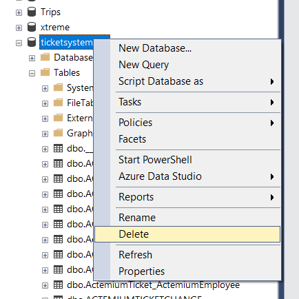
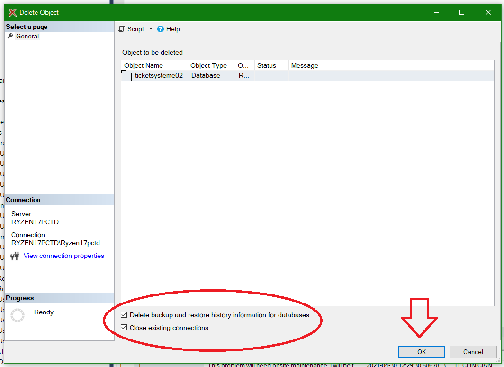

Then Create new Database

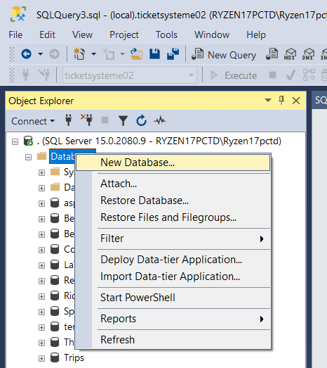
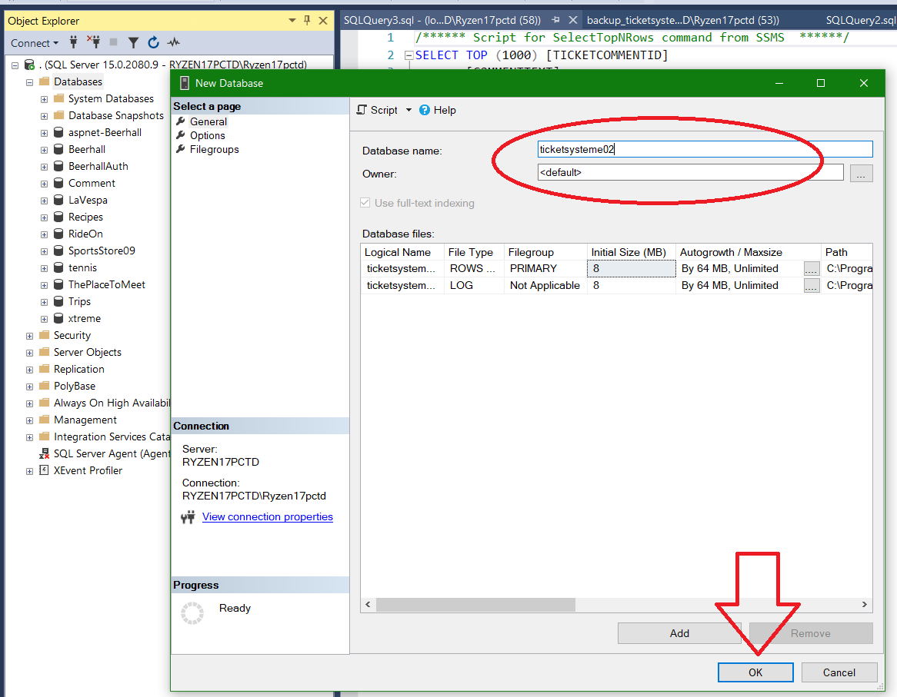

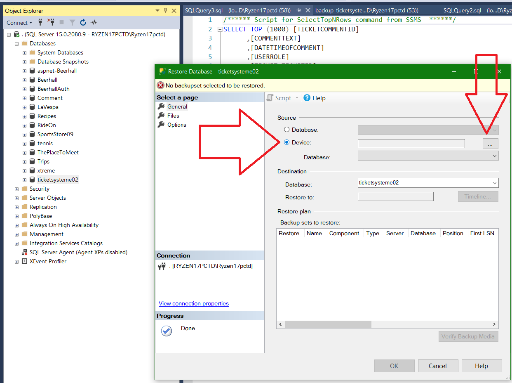
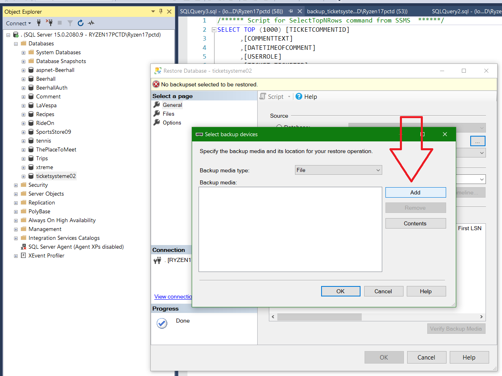
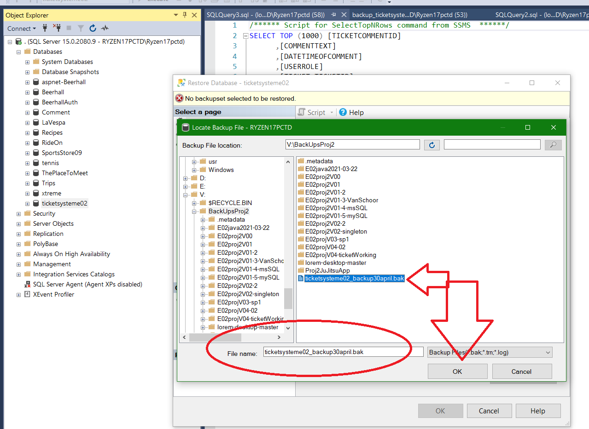
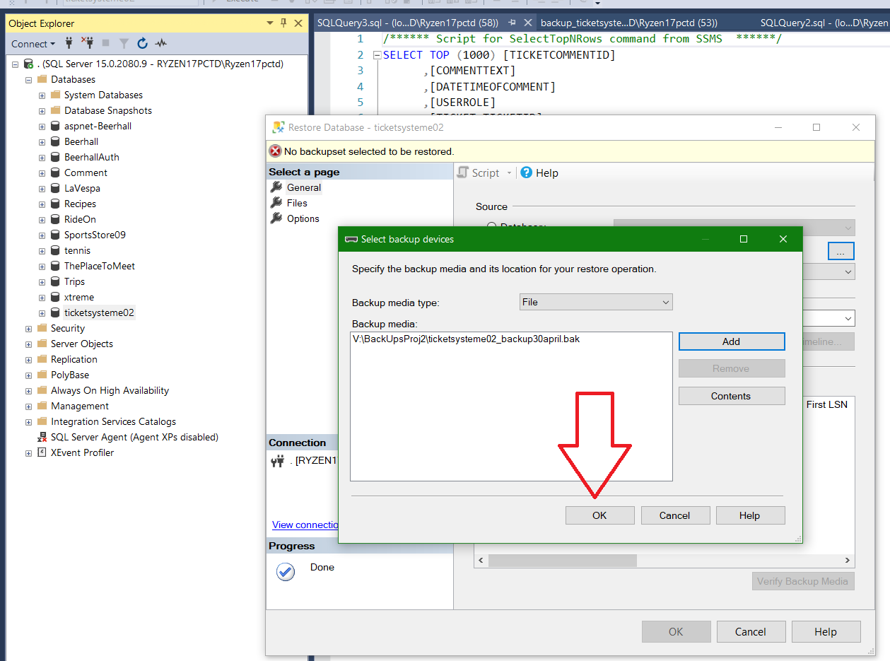
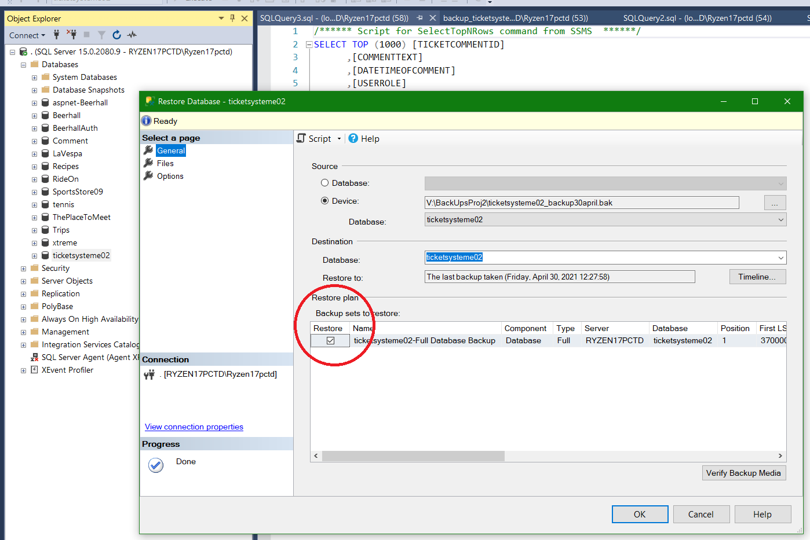
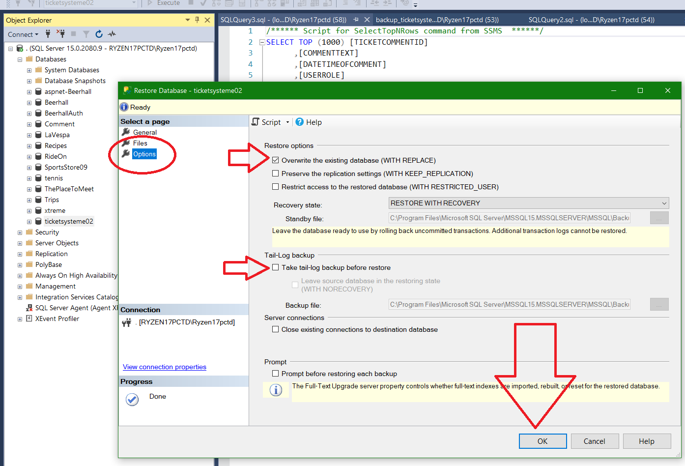
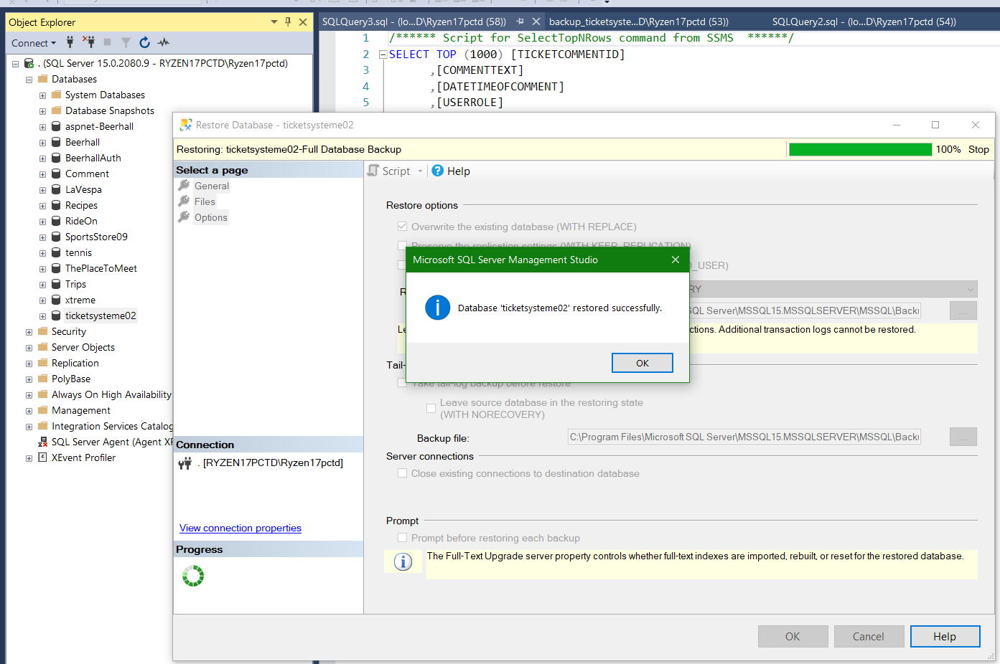

## SCSS
The SCSS is already compiled to make it easier to run.
Normally you shouldn't include the compiled CSS, but in this case we did.

Compile Sass Files in Visual Studio 2019 Using Web Compiler:
https://andyp.dev/posts/compile-sass-files-in-visual-studio-2019-using-web-compiler

Or compile via your IDE SCSS compiler
