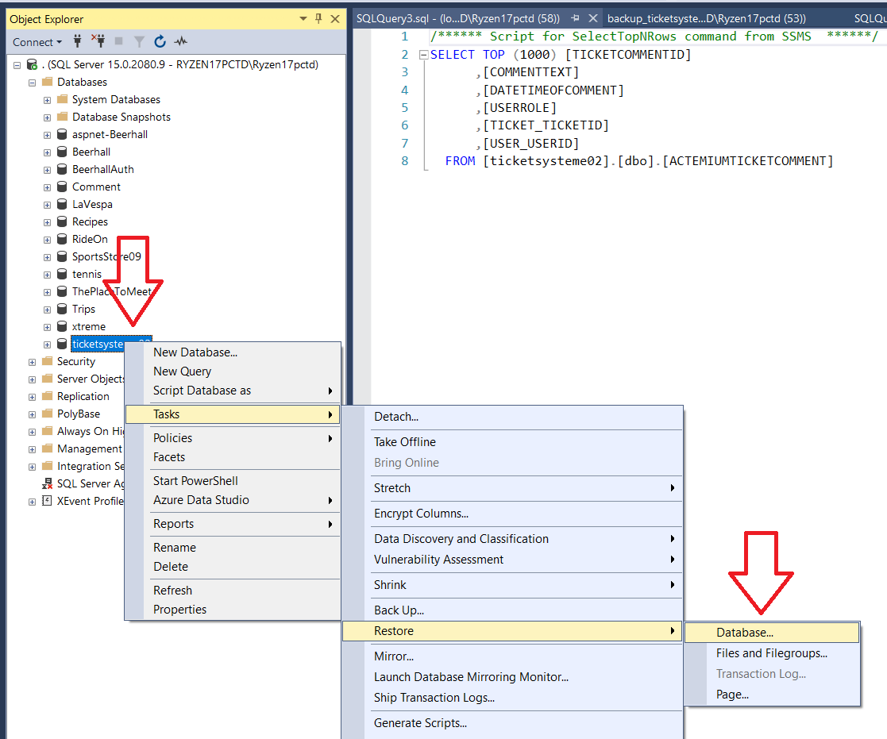

# 2021-dotnet-e-02

# Installation

## MS SQL Server
Restore database via [ticketsysteme02.bak](./SQL/ticketsysteme02_backup30april.bak)

If database ticketsysteme02 already exists => Delete first

Then Create new Database

   
## SCSS
2. (For now) make sure that `styles.scss` is compilated 

Compile Sass Files in Visual Studio 2019 Using Web Compiler:
https://andyp.dev/posts/compile-sass-files-in-visual-studio-2019-using-web-compiler
